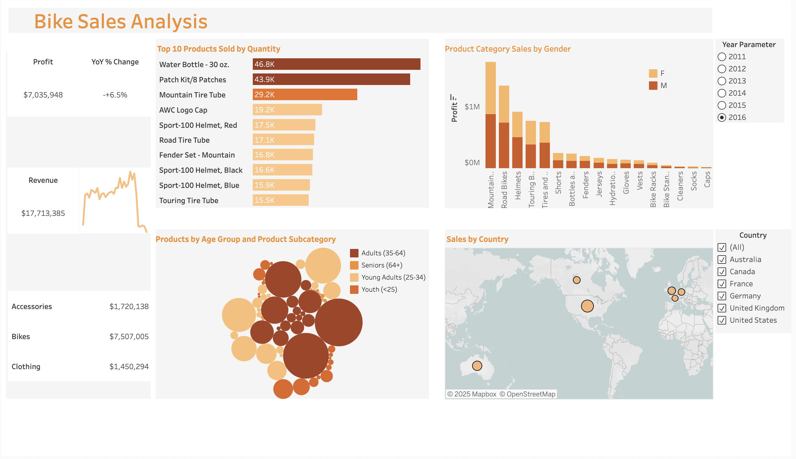
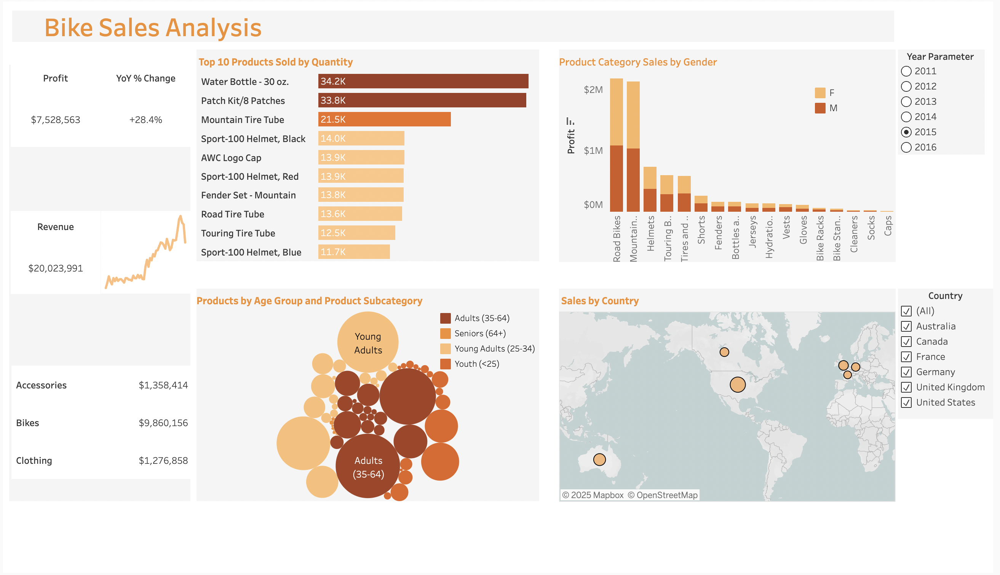
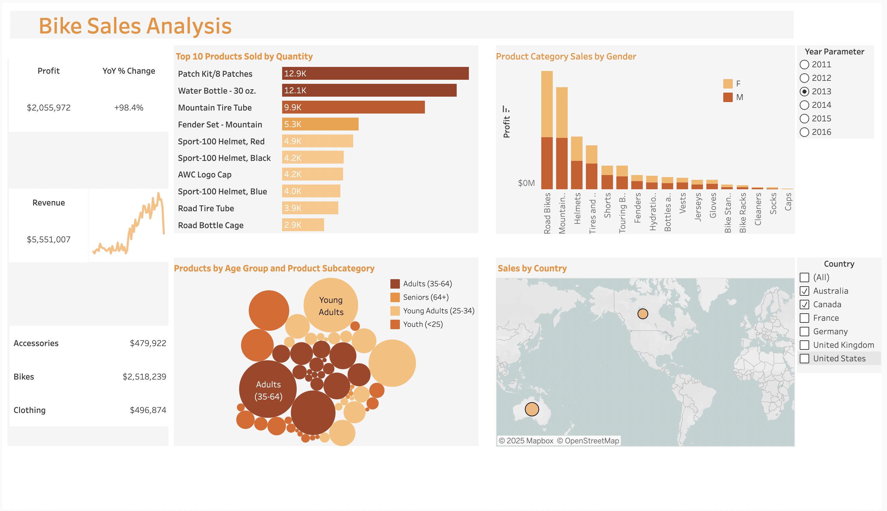

## Bike Sales Analysis Dashboard

This project contains a Tableau dashboard that visualizes bike sales performance across regions, products, and demographics.

## Live Version
[View the Bike Sales Dashboard](https://public.tableau.com/app/profile/shounak.sawant/viz/BikeSales_17545836083650/BikeSalesDashboard?publish=yes)

## Files
[Raw Data](Bike_sales_data.xlsx)

## Dashboard Preview

## Dashboard Features
- **Profit and Revenue Tracking** — Year-over-year change and total sales figures.  
- **Top 10 Products Sold by Quantity** — Highlighting most popular bike related items.  
- **Product Category Sales by Gender** — Comparison of male vs. female purchasing patterns.  
- **Products by Age Group and Subcategory** — Visualization of demographic preferences.  
- **Sales by Country** — Geographic distribution of sales across global markets.  

## Tools Used
- Tableau Desktop  
- **Data Source:** Bike sales dataset (contains product, demographic, and sales data)
